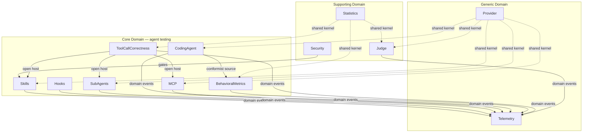

# Domain-Driven Design — robotframework-agentguard

This folder is the strategic-design source of truth for `robotframework-agentguard`, a Robot Framework library that tests **Agent Skills, Hooks, SubAgents, and MCP Servers** for modern coding agents (research §1).

The model is derived end-to-end from `docs/research/research.md`. Every term used here traces back to a research section or an external standard (MCP, A2A, Agent Skills spec, BFCL, Inspect AI, issue `anthropics/claude-code#42796`).

## Index

| File | Purpose |
|---|---|
| `ubiquitous-language.md` | Glossary — every domain term, one-line definition, source. |
| `bounded-contexts.md` | The 12 bounded contexts: aggregates, value objects, events, repositories, ACL. |
| `context-map.md` | Mermaid context map: relationships, integration patterns, kernels. |
| `aggregate-design.md` | Detailed invariants for the 4 most complex aggregates. |

## The 12 Bounded Contexts

## Strategic Classification

| Tier | Contexts | Why |
|---|---|---|
| **Core** | Skills, Hooks, SubAgents, CodingAgent, MCP, ToolCallCorrectness, BehavioralMetrics | The library exists to test these. They encode the standards (MCP, Agent Skills, A2A) and the metric catalog (#42796, BFCL) that competitors do not yet cover end-to-end. |
| **Supporting** | Judge, Statistics, Security | Necessary for trustworthy assertions over non-deterministic systems (§2.7) and for safe evaluation of third-party skills (§8.3) but not differentiating on their own. |
| **Generic** | Provider, Telemetry | Solved problems we delegate to LiteLLM and OpenTelemetry / Robot Framework listeners (§4.1, §4.5). |

## Reading Order

1. `ubiquitous-language.md` — vocabulary first, so every later document reads consistently.
2. `bounded-contexts.md` — what each context owns and emits.
3. `context-map.md` — how contexts integrate (kernels, ACLs, conformists, published languages).
4. `aggregate-design.md` — invariants for the four hardest aggregates: `Skill`, `A2ATask`, `CodingAgentSession`, `BFCLEvaluation`.

## Coordination With Other Streams

- The `system-architect` / `adr-architect` agent writes ADRs in parallel; ADR `Bounded Context:` fields use the names here verbatim (`Provider`, `MCP`, `Skills`, `Hooks`, `SubAgents`, `CodingAgent`, `Statistics`, `Judge`, `Security`, `Telemetry`, `BehavioralMetrics`, `ToolCallCorrectness`).
- The `security-architect` deepens the **Security Context** threat model. This folder defines only its boundary and integration points.
- This list is also stored in RuFlo memory under `agentguard/planning::ddd_bounded_contexts`.
