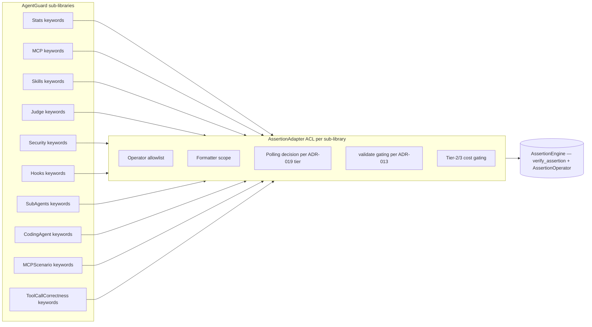

# AssertionEngine — Utility Shared Kernel

> **Status**: Proposed (gates on **ADR-022**,
> `docs/adr/ADR-022-assertion-engine-adoption.md`).
> Cross-references: **ADR-013** (sandbox policy),
> **ADR-019** (3-tier model routing),
> `docs/research/assertion-engine.md` (operator catalogue),
> `tests/experiments/exp_11_validate_under_robot.robot` (operator coverage),
> `tests/experiments/exp_12_aggressive_collapse.robot` (resistant-case feasibility).

This document specifies the DDD model for adopting the PyPI
`robotframework-assertion-engine` library (Python import name `assertionengine`)
as a **utility-level Shared Kernel** spanning every AgentGuard context
that exposes `Get/Should` keyword pairs (Stats, MCP, Skills, Hooks, SubAgents,
CodingAgent, MCPScenario, ToolCallCorrectness, Security, Judge).

It owns no aggregates, no domain events, no repositories. It is *shared
plumbing*, modelled the same way Python's `dataclasses` would be: a vocabulary
of value-comparison primitives consumed identically across the bounded
contexts that need them.

> **Adoption strategy (revised 2026-05-05)**: ADR-022 ships as a **single-phase
> full replacement**, not a multi-phase deprecation. Should-pair keywords
> selected for collapse are *deleted* in the same commit that introduces the
> operator-driven Get equivalent. No shim wrappers exist in the steady state.
> See `docs/adr/ADR-022-assertion-engine-adoption.md` §"Phase 4-D — One-Shot
> Replacement". The collapse policy is articulated below in §6.

---

## 1. What "utility Shared Kernel" means in our model

The bounded-contexts spec already uses **Shared Kernel** in two senses; we
make the distinction explicit here:

| Variant | Example | Shape of the shared surface | Coordination cost |
|---|---|---|---|
| **Context-level SK** | `Provider ↔ {MCP, Skills, Judge, CodingAgent, SubAgents}`; `Statistics ↔ {Judge, BehavioralMetrics, ToolCallCorrectness}` | Domain-shaped value objects (`Model`, `Distribution`, `EffectSize`) whose semantics belong to a domain we own. | High — roadmap coordination across all sharing contexts; type changes are domain-meaning changes. |
| **Utility-level SK** | `AssertionEngine ↔ everyone with Get/Should keywords` | Primitive comparison vocabulary (`AssertionOperator` enum, `verify_assertion()` function, formatter scope, polling protocol) independent of any AgentGuard domain. | Low — versioned external dependency; per-context policy (allow/deny operators) lives at the boundary, not in the kernel. |

The utility-level SK *intentionally does not* participate in our ubiquitous
language as a domain. It contributes a small set of cross-cutting value
objects (Section 3) that every context references the same way — like every
context references `pathlib.Path` without `pathlib` being a context.

---

## 2. AssertionAdapter ACL — boundary contract

Each AgentGuard sub-library (one per context with assertion-bearing keywords)
exposes a thin `AssertionAdapter` that wraps `assertionengine.verify_assertion`.
The adapter is the **single point** at which library-specific concerns are
applied; the library code never imports `assertionengine` directly outside the
adapter.

Adapter responsibilities (no code — DDD shape only):

- **Operator allowlist**. Each library declares which `AssertionOperator`
  values it supports for which keyword. The adapter rejects unsupported
  operators with `OperatorNotSupportedError`. Example: `Tool Hit Rate Should
  Be` accepts `==`, `>=`, `>`, `inrange`; it rejects `validate`, `*=`,
  `matches`.
- **Formatter scope per keyword**. Each `Get*` keyword owns its normalisation
  rules (e.g., string-trim, case-fold, JSON-canonicalise). The adapter resolves
  the active formatter scope from the keyword's own configuration block, never
  from a process-global state — different keywords inside the same suite must
  be able to disagree about formatting.
- **Polling decision per keyword tier (ADR-019)**. The adapter consults the
  routing tier of the keyword; see ACL Rule A in Section 4.
- **`validate` operator gating (ADR-013)**. The adapter intercepts `validate`
  invocations before delegating; see ACL Rule B in Section 4.
- **Cost gating for Tier-2/3 keywords (ADR-019)**. Any keyword whose result is
  produced by an LLM call (Tier 2 or 3) declares a per-invocation cost
  budget. The adapter records the realised cost into the routing audit trail
  and refuses retries that would exceed budget.

Diagram — AssertionAdapter sitting between sub-libraries and AssertionEngine:

---

## 3. Ubiquitous-language additions (value objects)

These four terms join `docs/ddd/ubiquitous-language.md` under a new
**Assertion Vocabulary** section. They are value objects (immutable, equality
by value) and are owned by no single context — they are the shared kernel
surface itself.

| Term | Definition | Source |
|---|---|---|
| **AssertionOperator** | The canonical enum of value-comparison symbols (`==`, `!=`, `<`, `<=`, `>`, `>=`, `contains`, `not contains`, `starts`, `ends`, `matches`, `*=`, `validate`, `inrange`, `then`, …). The full symbol set is defined in `docs/research/assertion-engine.md`. | ADR-022 |
| **Implicit Assertion** | The pattern by which a `Get*` keyword takes an `AssertionOperator` parameter and, when supplied, asserts in-place rather than returning a raw value. The keyword's user-visible name therefore doubles as both query and verifier. | ADR-022; `robotframework-assertion-engine` README |
| **Polling Window** | A per-keyword retry budget expressed as `(timeout, interval)` over which `verify_assertion` is re-invoked until success. **Default `0` (no polling) for any LLM-touching keyword** (see ACL Rule A). | ADR-022, ADR-019 |
| **Formatter Scope** | A per-keyword set of normalisation rules applied to the *actual* value before comparison (e.g., trim, case-fold, JSON-canonicalise, strip-ANSI). Resolved from the keyword's configuration block; never from process-global state. | ADR-022 |

These value objects do **not** carry domain meaning. They describe how
comparisons are performed, not what is being compared. This is what makes
AssertionEngine a *utility* SK and not a context.

---

## 4. Anti-corruption-layer rules at the AE boundary

The AssertionAdapter enforces two non-negotiable rules at the AE boundary.
These are gates, not policies — violating them is a domain error.

### Rule A — Polling AVOIDANCE for Tier-2/3 keywords

**Per ADR-019** (`docs/adr/ADR-019-3-tier-model-routing.md`), every keyword
carries a routing tier (1, 2, 3). The adapter must enforce:

- Tier-1 keywords (Agent Booster / pure compute, e.g., AST equality,
  regex, JSON-Schema) **may** configure `with_assertion_polling`.
- Tier-2 (Haiku) and Tier-3 (Sonnet/Opus) keywords **must not** configure
  `with_assertion_polling`. Any attempt raises `PollingDisallowedError`
  before the call reaches `verify_assertion`.

**Rationale**. Polling is "retry until the value matches". For an LLM-backed
`Get*` (e.g., a Judge classification, a Skill grader verdict), every retry
re-invokes the model — token cost compounds linearly with retry count and
non-determinism makes the retry semantically *different* (a different
sample, not a re-observation). Polling LLM-backed assertions silently
inflates Tier-2/3 spend and conflates flakiness with disagreement. The gate
forces users who want re-sampling to use Statistics' explicit `pass@k` /
`runs >= 1` machinery, which keeps the cost auditable.

**Effect on `Polling Window` value object**. For a Tier-2/3 keyword the
adapter coerces the polling window to the constant `(0, 0)` and emits a
diagnostic if the user supplied a non-zero value. The user-facing error
points at the explicit override path (`runs=` parameter on the keyword,
backed by Statistics).

### Rule B — `validate` operator SANDBOXING

**Per ADR-013** (`docs/adr/ADR-013-sandbox-policy.md`), code execution is
opt-in via `--allow-code-execution`. AssertionEngine's `validate` operator
takes a Python expression as a string and evaluates it against the actual
value (the upstream library uses `eval`). This is, by construction, a
remote-code-execution surface.

The adapter must enforce:

- The `validate` operator is **disabled by default**. Any invocation raises
  `ValidateOperatorDisallowed` with remediation guidance pointing at
  ADR-013.
- When `--allow-code-execution=True` is set on the consuming sub-library,
  the adapter delegates `validate` execution into the configured
  `SandboxBackend` from the Security context (`docker` / `k8s` / `proxmox`
  per ADR-013). The Python expression runs inside the sandbox boundary, not
  on the runner host.
- The default `SandboxBackend` is `process` (no isolation); under that
  backend `validate` remains a no-op that raises
  `ValidateOperatorDisallowed`. Only an *explicit* sandbox backend choice
  combined with the `--allow-code-execution` flag enables `validate`.

**Rationale**. The `validate` operator is the only AssertionEngine primitive
that escapes the closed value-comparison algebra. Treating it as a code-
execution event (and routing it through the same gate as agent-generated
code) preserves the security invariants of the Security context without
forcing AssertionEngine to know what a sandbox is.

---

## 5. Boundaries kept clean

- AssertionEngine never sees AgentGuard domain types. The adapter passes
  primitives (str, number, bool, list, dict).
- AgentGuard contexts never see `assertionengine` exceptions. The adapter
  translates them into context-typed errors (`OperatorNotSupportedError`,
  `PollingDisallowedError`, `ValidateOperatorDisallowed`,
  `AssertionFailed`).
- No domain events are added. Assertion outcomes are observable through
  whichever context's existing events already cover the keyword (e.g.,
  `JudgmentScored`, `ToolCallRecorded`, `MetricComputed`).

---

## 6. Collapse policy — what migrates, what stays (revised 2026-05-05)

The single-phase replacement (no shims, no deprecation) makes the
"what to collapse?" question crisp: **a Should-pair keyword collapses iff its
operator-form replacement reads at least as cleanly at the call site.**
This rule is articulated as a hard policy here so future sub-libraries do not
re-litigate it.

| Keyword shape | Decision | Rationale (with experimental backing) |
|---|---|---|
| Pure scalar comparison: `<Metric> Should Be {Above\|Below\|Equal To\|Zero\|Between}` | **COLLAPSE.** Delete Should-pair; add `(operator, expected, message)` to the Get keyword. | The operator form (`Read Edit Ratio ${s} >= 4.0`) is shorter and IDE-completable. exp_11 confirms `validate` covers the `between` case via `${low} <= value <= ${high}` so no custom operator is needed. 32 collapses per `docs/proposals/keyword-reduction-table.md`. |
| Domain predicate: `Should Not Call Any Tool`, `Hook Should Block`, `Hook Should Allow`, `Hook Decision Should Be`, `Skill Should Pass Security Scan`, `Required Tool Should Have Been Called With Params`, `Tool Sequence Should Match` | **KEEP** as named keyword. | exp_12 (16/16 PASS) confirms each *technically* folds into a `validate` expression over the keyword's typed return. Kept because the named-keyword call site reads cleaner than the equivalent inline `validate ...`. Example: `Skill Should Pass Security Scan ${path}` vs `Scan Skill ${path} validate value.decision != 'deny' and not [f for f in value.findings if f.severity.name == 'CRITICAL']` — the named form wins on simple-syntax + focused-keyword grounds. |
| Distribution-shaped assertion: `Mann Whitney U Should Show Improvement`, `Tool Hit Rate Distribution Should Stochastically Dominate`, `Cliffs Delta Should Be At Least` | **KEEP** as named keyword. | The "expected" argument is a *distribution*, not a scalar — AssertionEngine's operator algebra is value-vs-value, not distribution-vs-distribution. exp_12 demonstrates the underlying `MannWhitneyResult` *can* be exposed via a `Get` + `validate value.pvalue < 0.05`, but the named keyword carries the statistical intent more clearly. |
| Composite multi-stage pipeline: `Behavioral Report Should Match Baseline`, `Skill Should Pass Security Scan` (7-stage scanner) | **KEEP** as named keyword. | Pipelines that fan out to per-element checks lose readability when forced through a single `validate` expression. Keep the dedicated keyword; the underlying machinery still uses the AssertionAdapter for the per-comparison primitives it does perform. |

### Why "readability beats raw count"

The user-stated goal is *"small amount of focused keywords with simple
syntax and a clean and maintainable codebase"*. The two halves of that goal
trade off in the resistant-case set:

- **Smallest count**: aggressive collapse → 115 keywords, every assertion via
  `Get + validate <python expr>`.
- **Simplest syntax**: focused predicate keywords → 131 keywords, semantic
  Should-style for predicates, operator-driven for scalars.

We pick the second (131) because the inline `validate` expressions for the
resistant cases are *less* simple at the call site than the existing named
predicate. Both trades respect "no shims, no deprecation"; the policy above
makes the choice deterministic for new sub-libraries.
- No new aggregate is introduced. AssertionEngine remains stateless from
  AgentGuard's perspective — every call is pure relative to the supplied
  formatter scope and polling window.
