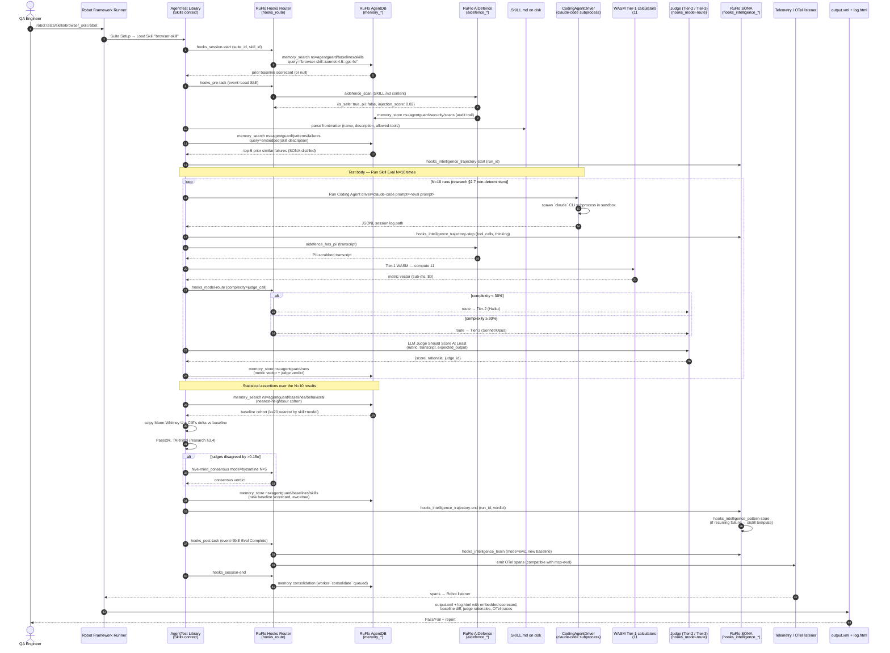

# End-to-end Data Flow — One Skill Grading Run

This document traces a single Robot Framework `.robot` test for one Agent Skill from user invocation through final report, showing exactly which RuFlo capability fires at each step. Reference for `adr-architect` ADRs ADR-015 (baselines), ADR-017 (judge), ADR-018 (behavioral metrics), ADR-020 (SONA + AIDefence).

## Sequence diagram

## Step annotations

| Step range | DDD context | RuFlo capability | Notes |
|---|---|---|---|
| 1–4 | Skills + Hooks | `hooks_session-start`, `memory_search` | Baseline pre-fetch ADR-015 |
| 5–8 | Security + Skills | `aidefence_scan`, `memory_store` audit | Mandatory (research §8.3) |
| 9–11 | BehavioralMetrics + SONA | `memory_search` failure patterns, `trajectory-start` | Surfaces "similar past failures" panel |
| 12–22 | CodingAgent + Telemetry | `trajectory-step`, `aidefence_has_pii`, WASM Tier-1, `hooks_model-route` | Inner loop, N=10 (research §2.7) |
| 23–26 | Statistics | `memory_search` baseline cohort, scipy stats | ADR-018 |
| 27–29 | Judge | `hive-mind_consensus` (Byzantine) | Only fires on judge disagreement; ADR-017 |
| 30–34 | Skills + SONA + Telemetry | `memory_store` (EWC), `pattern-store`, `hooks_intelligence_learn`, `hooks_post-task` | Persists learning |
| 35–38 | Telemetry | OTel listener, output.xml | Standard Robot reporting + embedded RuFlo metrics |

## Key invariants

- **Every external input is AIDefence-scanned** before reaching the judge or being persisted.
- **Tier-1 WASM runs first** for the 11 deterministic metrics; LLM judges only fire when the metric vector or rubric demands it (cost discipline).
- **Baselines are stored with EWC++** so adding a new skill never overwrites prior skill baselines.
- **Judge disagreements escalate to Byzantine consensus**, not silently averaged.
- **Trajectories are SONA-recorded for every run**, not only failures, so pattern extraction has positive examples too.
